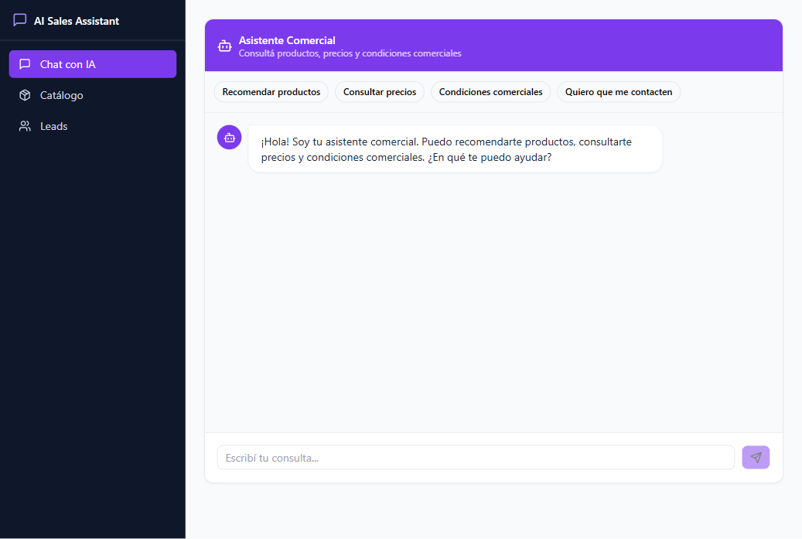
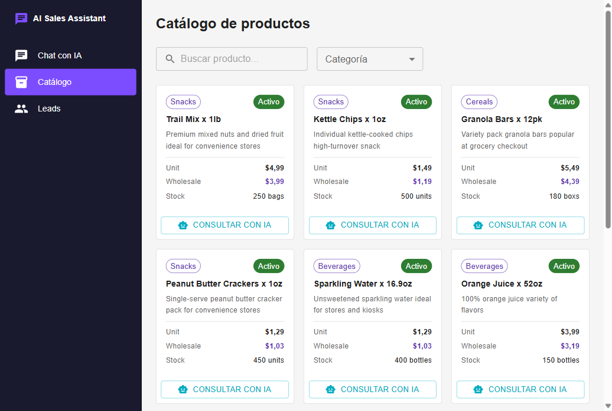
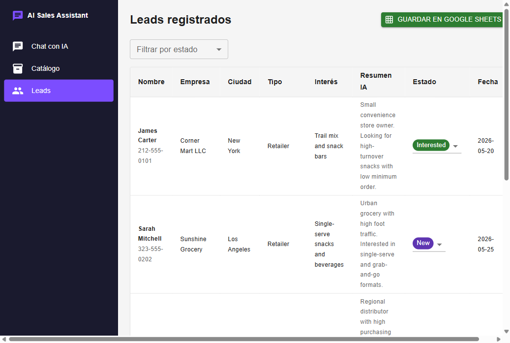

# AI Sales Assistant

**Full-stack TypeScript web app that automates B2B commercial attention with AI: it answers product and pricing questions, recommends items through semantic search, resolves commercial conditions and captures qualified leads — all from a single streaming chat. Built as a modular monolith on Next.js 14, where the same app serves both the interface and the server, with no separate Express or NestJS backend.**

> Resumen en español: Asistente comercial B2B con IA. Responde consultas, recomienda productos con búsqueda semántica (RAG), consulta condiciones comerciales y registra leads con un resumen comercial generado por IA. Es un monolito modular en Next.js 14 (frontend, backend, base de datos y documentación en una sola app, sin microservicios), desplegable en Railway con Docker.

---

## Demo

<table>
  <tr>
    <td align="center"><b>Chat — Streaming AI + Tool Calling</b></td>
    <td align="center"><b>Catalog — Product Explorer</b></td>
    <td align="center"><b>Leads — Pipeline + Sheets Export</b></td>
  </tr>
  <tr>
    <td></td>
    <td></td>
    <td></td>
  </tr>
</table>

---

## Key Features

- **AI chat:** token-by-token streaming conversation with autonomous multi-step tool calling.
- **Semantic product search (RAG):** OpenAI embeddings + pgvector cosine similarity over the catalog.
- **Commercial conditions:** minimum purchase, discounts, payment method and terms resolved per client type.
- **AI-enriched lead capture:** the model detects purchase intent, generates a commercial summary and persists the lead.
- **Product catalog:** server-side fetch with client-side filtering and a responsive card grid.
- **Leads pipeline:** status management and one-click export to Google Sheets (zero-CRM).
- **Modular monolith:** a single Next.js app with a logical split between `frontend/`, `backend/` and `bd/`.

The assistant exposes three tools and the model decides when to invoke each one, chaining calls within a single conversation:

- **`searchProducts`** — semantic product search.
- **`getConditions`** — commercial conditions lookup.
- **`createLead`** — registers an interested client and generates an AI commercial summary.

---

## Key Technical Highlights

### 1 · Streaming chat with multi-step tool calling

The entire AI backend is a single Route Handler. Three tools are bound to the model — it decides autonomously when to invoke them and chains calls without extra orchestration code.

```ts
// app/src/app/api/chat/route.ts
export async function POST(req: Request) {
  const { messages } = await req.json()

  const result = streamText({
    model: openai('gpt-4o-mini'),
    system: SYSTEM_PROMPT,
    messages,
    tools: { searchProducts, getConditions, createLead },
    maxSteps: 5,                      // model chains calls autonomously
  })

  return result.toDataStreamResponse() // token-by-token stream to the client
}
```

### 2 · Semantic product search with pgvector

No external vector database. Cosine similarity runs directly on the same PostgreSQL instance via pgvector's `<=>` operator.

```ts
// app/src/backend/ai/rag.ts
export async function searchByEmbedding(query: string, limit = 5) {
  const { embedding } = await embed({
    model: openai.embedding('text-embedding-3-small'),
    value: query,
  })

  return prisma.$queryRawUnsafe<ProductResult[]>(
    `SELECT id, nombre, categoria, descripcion,
            precio_unitario, precio_mayorista, stock,
            1 - (embedding <=> $1::vector) AS similarity
     FROM products
     WHERE activo = true AND embedding IS NOT NULL
     ORDER BY embedding <=> $1::vector
     LIMIT $2`,
    `[${embedding.join(',')}]`,
    limit
  )
}
```

### 3 · AI-enriched lead capture via tool calling

When the model detects purchase intent it calls `createLead`. Before persisting the record it generates an AI commercial summary — so every lead in the pipeline arrives pre-qualified.

```ts
// app/src/backend/ai/tools.ts
export const createLead = tool({
  description: 'Register a lead when the user shows purchase intent.',
  parameters: z.object({
    nombre: z.string(),
    telefono: z.string(),
    empresa: z.string().optional(),
    tipo_cliente: z.enum(['Retailer', 'Wholesaler', 'Distributor']).optional(),
    interes_producto: z.string().optional(),
    ciudad: z.string().optional(),
  }),
  execute: async (data) => {
    // AI generates a commercial summary before the record is saved
    const { text: resumen_ia } = await generateText({
      model: openai('gpt-4o-mini'),
      prompt: `Write a 1-2 sentence commercial summary for this lead:\n${JSON.stringify(data)}`,
    })

    const lead = await prisma.lead.create({
      data: { ...data, estado_lead: 'New', resumen_ia },
    })

    return { leadId: lead.id, message: `Lead registered. Sales team will contact ${data.nombre} shortly.` }
  },
})
```

---

## Architecture

Modular monolith — a single Next.js 14 app serves the UI and the server. Logical layers, not microservices.

```
Frontend — React / Next.js
  Chat (AI) · Catalog · Lead management
        │
        ▼
Backend — Next.js
  Route Handlers · Server Actions · Commercial logic
        │
   ┌────┴──────────────┬──────────────────┐
   │                   │                   │
 AI layer           Data layer         Integration
 Vercel AI SDK      Prisma ORM         Google Sheets API
   │                   │
   ▼                   ▼
 OpenAI GPT-4o-mini  PostgreSQL + pgvector
 + text-embedding    Products · Commercial conditions
   -3-small          Leads · Embeddings
```

---

## Project Structure

```
PrAiSalesAssistant/
├── app/        # Next.js 14 app (App Router): src/frontend, src/backend, src/app (routes)
├── bd/         # Prisma schema, seeds and CSVs (clientes, productos, condiciones_comerciales)
├── descr/      # Functional and technical specs — source of truth (Spec Driven Development)
├── docs/       # Screenshots and supporting material
└── sessions/   # Session summaries
```

---

## Tech Stack

| Layer | Technology |
|---|---|
| Framework | Next.js 14 · App Router |
| Language | TypeScript |
| Frontend | React 18 |
| Styling | Tailwind CSS · shadcn/ui |
| State | Zustand |
| Backend | Next.js Route Handlers · Server Actions |
| AI | Vercel AI SDK · OpenAI GPT-4o-mini |
| RAG | OpenAI Embeddings · pgvector |
| Database | PostgreSQL |
| ORM | Prisma 5 |
| Validation | Zod |
| Integrations | Google Sheets API |
| Infrastructure | Railway · Docker |

---

## Getting Started

```bash
git clone https://github.com/nuvarynSA/AiAssistant.git
cd AiAssistant/app
npm install

# configure environment (OpenAI key, PostgreSQL URL, Google Sheets credentials)
cp .env.example .env.local   # if available; otherwise create .env.local

npx prisma migrate dev       # apply the schema
npm run seed                 # load CSVs from bd/seeds
npm run dev                  # http://localhost:3000
```

| Script | Action |
|---|---|
| `npm run dev` | development server |
| `npm run build` | production build |
| `npm start` | serve the production build |
| `npm run lint` | linter |
| `npm run seed` | seed the database from CSVs |

> Requires a PostgreSQL instance with the `pgvector` extension, an OpenAI API key and Google Sheets API credentials for lead export. `docker-compose.yml` is provided to run PostgreSQL + pgvector locally.

---

## What this solves

Most B2B companies lose leads because response time is too slow. This assistant answers instantly, qualifies intent through conversation, and hands off a warm lead — AI-enriched — before a sales rep ever gets involved. First touch: fully automated.

> MVP scope: Chat · Catalog · Leads. No auth required. Deploy-ready on Railway.

---

## Keywords

TypeScript, Next.js 14, React 18, Vercel AI SDK, OpenAI, GPT-4o-mini, tool calling, RAG, retrieval augmented generation, embeddings, pgvector, semantic search, PostgreSQL, Prisma, Zod, Zustand, Tailwind CSS, shadcn/ui, Server Actions, Route Handlers, Google Sheets API, B2B sales automation, AI sales assistant, lead capture, modular monolith, Railway, Docker.

**Suggested GitHub topics:** `typescript` `nextjs` `react` `vercel-ai-sdk` `openai` `rag` `pgvector` `prisma` `postgresql` `zustand` `tailwindcss` `shadcn-ui` `b2b` `sales-automation` `ai-assistant` `railway` `docker`
